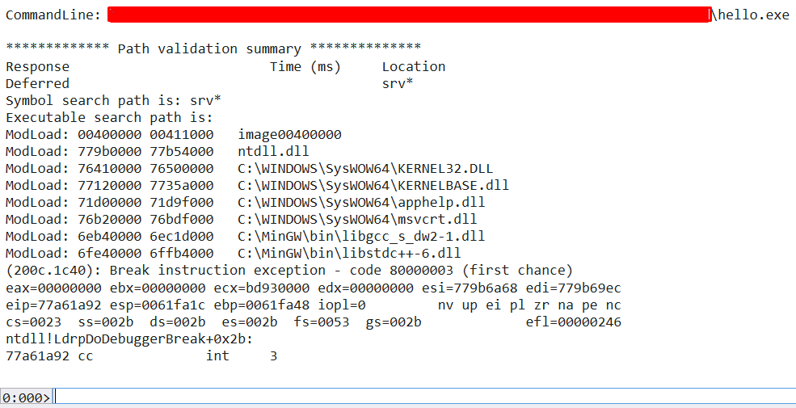

# **WinDbg**
***WinDbg*** — это отладчик, который можно использовать для анализа аварийных дампов, отладки динамического кода в пользовательском и режиме ядра, а также для анализа регистров ЦП и памяти.

Первая область: окно, где выводится результат выполнения команд.
Вторая область: небольшое текстовое поле для ввода команд.

## **Проверка и загрузка символов**

***Символы*** – это файлы, которые генерируются вместе с исполняемым файлом во время компиляции программы и содержат отладочную информацию (функции и имена переменных). Отладочная информация позволяет исследовать функциональность приложения во время отладки или дизассемблирования. Многие компоненты Microsoft компилируются вместе с символами, которые распространяются через Microsoft Symbol Server.

Если нужно импортировать символы во время отладки, то можно сделать это при помощи .sympath 

`0:000> .sympath+ c:\SomeOtherSymbolFolder`

Затем выполнить перезагрузку символов

`0:000> .reload`

Чтобы увидеть, для каких модулей загружены символы можно воспользоваться командой x*!. Команда x*! покажет символы, которые могут быть загружены.

`0:000> x*!`

Можно принудительно загрузить символы при помощи команды ld*

`0:000> ld*`

## **Отладка локального процесса**
Локальную отладку процесса можно осуществить 2 способами:

    1. Подцепиться к уже запущенному процессу.
    Зайти в «File:Attach to a Process» и выбрать PID или имя процесса.
    2. Запустить процесс через WinDBG.
    Зайти в «File:Open Executable» и выбрать исполняемый файл для отладки.

Если запуск программы происходит с помощью WinDBG, то подключаются специальные отладочные опции (например, отладка кучи), которые могут привести к краху приложения. Но существуют программы, которые аварийно заканчиваются свою работу, когда к ним подключается отладчик. Обычно вредоносы проверяют присутствие отладчика в системе и могут не запуститься, тогда следует цепляться к запущенному процессу. Иногда происходит отладка службы под управлением ОС Windows, которая устанавливает некоторые параметры во время запуска, так что для упрощения процесса отладки, также лучше подцепляться к запущенному процессу, а не запускать службу через отладчик.

Чтобы подцепиться к уже запущенному процессу зайдите в «File:Attach to a Process», а затем выберите PID или имя процесса. Помните о том, что вам необходимо иметь соответствующие права, чтобы подцепиться к процессу.

## **Отладка удаленного процесса**

Если вы уже начали локальную отладку программы (посредством подключения или запуска процесса через WinDBG), то можете ввести определенную команду:

`.server tcp:port=5005`

и WinDBG запустит «слушатель» (listener), к которому сможет подключиться удаленный отладчик.

Теперь вы может подключиться с удаленного хоста к уже существующей отладочной сессии, зайдя в «File:Connect to a Remote Session» и введя в текстовое поле примерно следующее:
