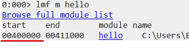

# **WinDbg**
***WinDbg*** — это отладчик, который можно использовать для анализа аварийных дампов, отладки динамического кода в пользовательском и режиме ядра, а также для анализа регистров ЦП и памяти.

Первая область: окно, где выводится результат выполнения команд.
Вторая область: небольшое текстовое поле для ввода команд.

## **Проверка и загрузка символов**

***Символы*** – это файлы, которые генерируются вместе с исполняемым файлом во время компиляции программы и содержат отладочную информацию (функции и имена переменных). Отладочная информация позволяет исследовать функциональность приложения во время отладки или дизассемблирования. Многие компоненты Microsoft компилируются вместе с символами, которые распространяются через Microsoft Symbol Server.

Если нужно импортировать символы во время отладки, то можно сделать это при помощи .sympath 

`0:000> .sympath+ c:\SomeOtherSymbolFolder`

Затем выполнить перезагрузку символов

`0:000> .reload`

Чтобы увидеть, для каких модулей загружены символы можно воспользоваться командой x*!. Команда x*! покажет символы, которые могут быть загружены.

`0:000> x*!`

Можно принудительно загрузить символы при помощи команды ld*

`0:000> ld*`

## **Отладка локального процесса**
Локальную отладку процесса можно осуществить 2 способами:

    1. Подцепиться к уже запущенному процессу.
    Зайти в «File:Attach to a Process» и выбрать PID или имя процесса.
    2. Запустить процесс через WinDBG.
    Зайти в «File:Open Executable» и выбрать исполняемый файл для отладки.

Если запуск программы происходит с помощью WinDBG, то подключаются специальные отладочные опции (например, отладка кучи), которые могут привести к краху приложения. Но существуют программы, которые аварийно заканчиваются свою работу, когда к ним подключается отладчик. Обычно вредоносы проверяют присутствие отладчика в системе и могут не запуститься, тогда следует цепляться к запущенному процессу. Иногда происходит отладка службы под управлением ОС Windows, которая устанавливает некоторые параметры во время запуска, так что для упрощения процесса отладки, также лучше подцепляться к запущенному процессу, а не запускать службу через отладчик.

Чтобы подцепиться к уже запущенному процессу зайдите в «File:Attach to a Process», а затем выберите PID или имя процесса. Помните о том, что вам необходимо иметь соответствующие права, чтобы подцепиться к процессу.

## **Отладка удаленного процесса**

Если вы уже начали локальную отладку программы (посредством подключения или запуска процесса через WinDBG), то можете ввести определенную команду:

`.server tcp:port=5005`

и WinDBG запустит «слушатель» (listener), к которому сможет подключиться удаленный отладчик.

Теперь вы может подключиться с удаленного хоста к уже существующей отладочной сессии, зайдя в «File:Connect to a Remote Session» и введя в текстовое поле примерно следующее:

## **Создание удаленного сервера**

Вы также можете создать отдельный сервер с WinDBG, удаленно подключаться к нему и выбирать процесс для отладки. Это можно сделать используя команду:

`dbgsrv.exe -t tcp:port=5005`

К серверу отладки вы можете подключиться, если зайдете в файл «File: Connect to Remote Stub» и введете в текстовое поле следующую строку: 

`tcp:Port=5005,Server=192.168.127.138`

## **Система помощи**
Команда `.hh` для доступа к справке WinDBG

Вы также можете получить справочную информацию по определенной команде: `.hh .reload`

## **Модули**

Во время работы программы импортируются различные модули, обеспечивающие функциональность приложения. Следовательно, если вы будете знать, какие модули импортированы приложением, то сможете лучше понять алгоритм его работы. Во многих случаях, вы будете отлаживать конкретный модуль, загруженный программой, а не сам исполняемый файл.

`lmf` - вывод модулей

`lmf m NAME` - адрес загрузки для конкретного модуля

`!dh NAME` - информацию о заголовке (image header) конкретного модуля

## **Сообщения и исключения**
Например, когда мы цепляемся к calc.exe, WinDBG автоматически устанавливает точку останова (которая является просто маркером, используемым для остановки приложения). Информация о точке останова выводится на экран:

`(da8.b44): Break instruction exception - code 80000003 (first chance)`

Конкретно это сообщение является исключением (first-chance). Исключение – это особое состояние, возникающее во время выполнения программы. First-chance исключение означает, что программа остановилась сразу же после появления исключения. Second-chance исключение означает, что после возникновения исключения будут выполнены некоторые операции, а потом программа остановит свою работу.

## **Регистры**
***Регистры*** – это специальные переменные внутри процессора, которые хранят небольшие куски информации или следят за состоянием чего-либо в памяти. Процессор может обрабатывать информацию в этих регистрах очень быстро. Это намного быстрее, чем каждый раз получать информацию по шине из RAM.

`r` - команда повторного отображения регистров

`r eax,ebp` - информация о конкретных регистрах

## **Указатель на инструкцию**
ntdll!DbgBreakPoint:

77db1a92    cc  int     3

Эквивалентный результат команды - `u eip L1`

77db1a92 - то, что содержится в регистре EIP. (`r eip`)
EIP – это регистр, содержащий местонахождение следующей инструкции, которую должен выполнить процессор. WinDBG идет по адресу, указанному в регистре EIP, преобразует этот участок в ассемблерный код и отображает его на экране.

## **Точки останова**
Точки останова – это маркеры, связанные с определенным адресом памяти, при достижении которых процессор останавливает выполнение программы. Приложение может состоять из миллионов ассемблерных инструкций, и проходить через каждую из них. Точки останова значительно сокращают время отладки, когда вы устанавливает маркер на определенную функцию, а процессор, автоматически выполняя весь предыдущий код, останавливается в нужном вам месте. Как только достигнута точка останова, программа останавливается, и вы можете начать отладку.

**Программные точки останова**

Перед выполнением программа сначала загружается в память, что позволяет нам временно контролировать участок памяти, связанный с программой, без влияния на процесс ее выполнения. Именно так и работают программные точки останова. Отладчик запоминает ассемблерную инструкцию (на которой мы хотим остановиться), где должна быть вставлена точка останова, затем заменяет ее на ассемблерную инструкцию **INT 3 (0xcc)**, которая заставляет процессор остановить выполнение программы. Как только точка останова достигнута, отладчик считывает текущий адрес памяти, достает ранее записанную инструкцию и показывает ее пользователю. Пользователю кажется, что программа остановился на этой инструкции, однако процессор не имеет ни малейшего представления о ее существовании.

В WinDBG программные точки останова устанавливаются при помощи команд `bp, bm, или bu`. Команда `bp (Break Point)`, вероятно, наиболее часто используемая команда, при помощи которой устанавливаются точки останова. Адрес, передаваемый команде bp, должен быть участком памяти с исполняемым кодом. Поскольку команда bp работает с памятью, где хранятся данные, то в некоторых случаях могут возникнуть проблемы, так как отладчик перезаписывает информацию, которая находится в участке памяти. Во избежание проблем компания Microsoft рекомендует использовать команду `ba` (о ней мы поговорим дальше) в случае, если вы работаете с памятью, где хранятся данные.

По умолчанию, при запуске программы через WinDBG, отладчик устанавливает точку останова в самом начале программы. Для определения начального адреса загрузки программы воспользуемся командой:

 `lmf m NAMEMODUL`.

Далее, используя адрес загрузки (start) и команду !dh, находим точку входа программы (address of entry point):

Теперь устанавливаем точку останова в точку входа (адрес загрузки + 0x3689):